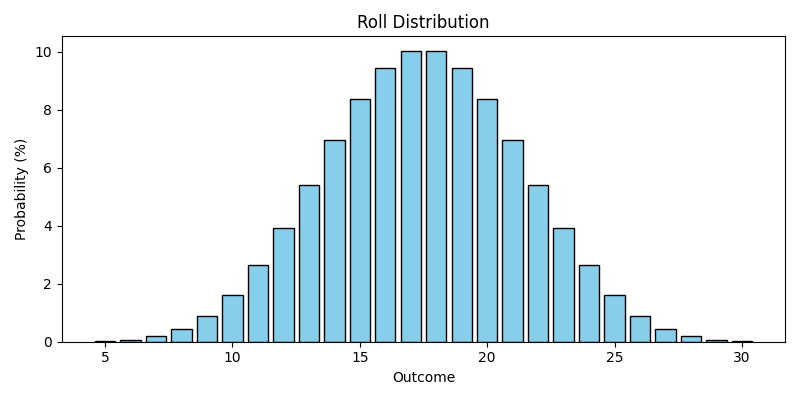

# dice-roller

[](https://img.shields.io/github/v/release/rguillon/dice-roller)
[](https://github.com/rguillon/dice-roller/actions/workflows/ci.yml?query=branch%3Amain)
[](https://codecov.io/gh/rguillon/dice-roller)
[](https://img.shields.io/github/commit-activity/m/rguillon/dice-roller)
[](https://img.shields.io/github/license/rguillon/dice-roller)

A simple library to compute probabilities with dice rolls.


Roll objects can be created from a simple RPG-like string expression:

```python

from dice_roller import Roll

Roll("D6")          # One 6 faced dice
Roll("2D8+1")       # Two 8 faces dices plus 1
Roll("5D10-1D6-1")  # Five 10 sided dices minus one 6 sided dice minus 1
Roll("1")           # A constant value of 1

```

Rolls can also be build from a custom map of value/probability

```python

# Using a 6 faces dice where 1 to 4 gives 0 points, a 5 gives 1 point, a 6 gives 2 points
dice = Roll(values={0:4, 1:1, 2:1})


```


Rolls can also be built on the fly

```python

from dice_roller import Roll

dice = Roll()

dice.add_event(event=1, probability=1)
dice.add_event(event=2, probability=1)

```

Rolls have two attributes:
* `distribution` returns a map of value/chances.
* `expected_value` returns the average value of the roll.

```python

>>> from dice_roller import Roll
>>> roll = Roll("2D6+1")
>>> print(roll.distribution)
{3.0: 1.0, 4.0: 2.0, 5.0: 3.0, 6.0: 4.0, 7.0: 5.0, 8.0: 6.0, 9.0: 5.0, 10.0: 4.0, 11.0: 3.0, 12.0: 2.0, 13.0: 1.0}
>>> print(roll.expected_value)
8.0

```

Rolls have a `normalized` function that turns a new Roll with the probabilities scaled so their sum equals the requested value

```python

>>> roll = Roll("D10")
>>> print(roll.distribution)
{1.0: 1.0, 2.0: 1.0, 3.0: 1.0, 4.0: 1.0, 5.0: 1.0, 6.0: 1.0, 7.0: 1.0, 8.0: 1.0, 9.0: 1.0, 10.0: 1.0}

# The sum of probabilities equals one.
>>> print(roll.normalized().distribution)
{1.0: 0.1, 2.0: 0.1, 3.0: 0.1, 4.0: 0.1, 5.0: 0.1, 6.0: 0.1, 7.0: 0.1, 8.0: 0.1, 9.0: 0.1, 10.0: 0.1}

# To get probabilitied as percentages
>>> print(roll.normalized(value=100).distribution)
{1.0: 10.0, 2.0: 10.0, 3.0: 10.0, 4.0: 10.0, 5.0: 10.0, 6.0: 10.0, 7.0: 10.0, 8.0: 10.0, 9.0: 10.0, 10.0: 10.0}


```

Rolls can be added and subtracted

```python

>>> from dice_roller import Roll
>>> assert Roll("3D6") == Roll("2D6") +Roll("1D6")
>>> assert Roll("2D6-D6") == Roll("2D6") - Roll("1D6")

```

Rolls implement comparison operators that will return a new Roll containing the probability of the True/False events:


```python

>>> from dice_roller import Roll
>>> (Roll("1D10") >= Roll("1D6")).distribution
{1.0: 45.0, 0.0: 15.0}

>>> (Roll("1D10") < Roll("1D20")).expected_value
0.725

```

Rolls implement a roll method that will returns random values according to their probabilities

```python

>>> result = Roll("1D6").roll()

```

And finally, Rolls implement to_figure method that returns a Matplotlib Figure that can be saved as an image

```python

>>> Roll("5D6").to_figure().savefig("images/5D6.png")

```


